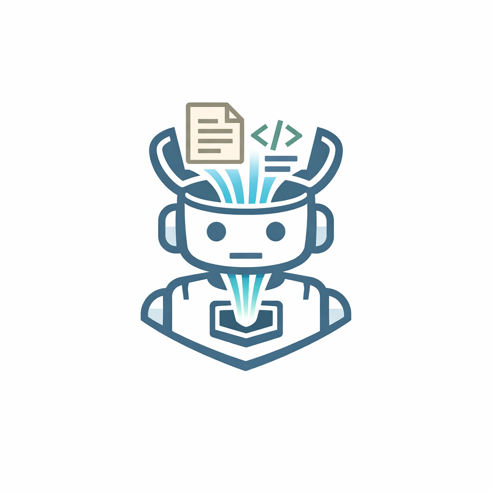
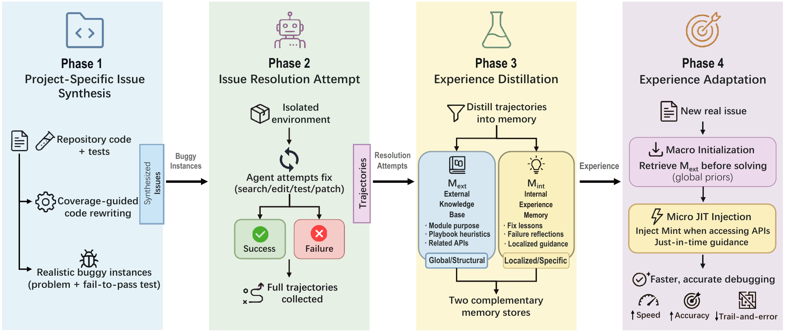

<p align="center">
  
</p>

# 🧠 SWE-Learner

[](https://www.python.org/downloads/)
[](https://www.swebench.com/)
[](https://www.docker.com/)

SWE-Learner is a framework for self-improving software-engineering agents. Rather than relying on fixed, general-purpose knowledge, it enables an agent to **actively synthesize project-specific issues**, **self-distill structured experience** from the resulting repair trajectories, and then **inject that experience at inference time** to solve new issues in the same codebase.

It extends **mini-swe-agent** with two additional components:

- **`synthesis/`** — proactively generate buggy instances for any GitHub repository and collect repair trajectories
- **`distilling/`** — self-distill structured *keypoints* and *environment knowledge* from those trajectories

The overall pipeline is: **synthesize → distill → run agent with experience**.

The agent code (with experience injection) lives in the standard `src/minisweagent/` package, exactly as in mini-swe-agent.

## 📄 Overview



---

## 📦 Repository layout

```
SWE-Learner/
  src/minisweagent/          mini-swe-agent core (with experience injection)
    agents/default.py          ← synthesized-experience env augmentation & keypoint injection
    utils/experience.py        ← load_synthesized_experience_jsonl
    utils/bm25_retriever.py    ← BM25Retriever (env knowledge top-k)
    run/extra/swebench.py      ← --synthesized-experience-keypoints / --synthesized-experience-env
    config/extra/
      synthesis.yaml           ← local-env config for trajectory collection
      swebench_exp.yaml        ← Docker/SWE-bench config with env_knowledge_top_k = 5

  synthesis/                 bug synthesis pipeline  [Step 1]
    strict_mask_generator.py   core bug generator (LLM-based masked code rewriting)
    tracer.py                  runtime code tracer
    code_analyzer.py           static code analyzer
    setup_repos.py             ① clone repos & create venvs for SWE-bench instances
    extract_tests.py           discover pytest node IDs (--collect-only) or load --user-tests JSON
    verify_tests.py            ② verify tests pass on base_commit → target_tests_verified.json
    generate_bugs.py           ③ generate buggy variants via strict_mask_generator
    prepare_instances.py       ④ assemble instances_for_trajectory.jsonl
    collect_trajectories.py    ⑤ run mini-swe-agent and collect repair trajectories

  distilling/                experience extraction pipeline  [Step 2]
    schema.py                  data classes
    trajectory_io.py           load trajectories & golden info
    llm_client.py              LLM wrapper (litellm + retry)
    code_index.py              AST-based Python scope indexer
    access_extractor.py        parse bash actions → code-access events
    experience_extractor.py    Stage ① main extraction pipeline
    repo_aggregator.py         Stage ② repo-level aggregation
    leakage_filter.py          Stage ③ evaluation-safety filter
```

---

## 🚀 Installation

```bash
pip install -e .
```

Copy `.env.example` to `.env` and fill in your API key:

```bash
cp .env.example .env
```

---

## 🐛 Step 1 — Synthesis: generate buggy instances & collect trajectories

The synthesis pipeline proactively creates `historical commits` by introducing controlled bugs into a target repository and collecting the agent's repair attempts.

### Prerequisites

```bash
# Install required packages
pip install coverage pytest

# Set API credentials
export OPENAI_API_KEY=...
export OPENAI_BASE_URL=...   # optional
```

### Step-by-step

```bash
# ⓪ Clone SWE-bench instances and create per-instance venvs (required before extract/verify)
python synthesis/setup_repos.py \
    --repo-url https://github.com/owner/repo.git \
    --dataset verified \
    --filter "owner__repo" \
    --work-dir synthesis/workdir

# ① Discover test cases for bug generation (pick one approach)

# A) Manual JSON: instance_id (same as under workdir/repos/) -> pytest node IDs
cat > synthesis/workdir/user_tests.json << 'EOF'
{
  "owner__repo-12345": [
    "tests/test_parser.py::TestParser::test_parse_empty",
    "tests/test_utils.py::test_format_string"
  ]
}
EOF

# B) Auto: run pytest --collect-only in each cloned repo under repos/<instance_id>/repo/
python synthesis/extract_tests.py \
    --work-dir synthesis/workdir \
    --output synthesis/workdir/target_tests.json

# ② Verify tests pass on the original code (use the same JSON you produced in ①)
python synthesis/verify_tests.py \
    --target-tests synthesis/workdir/target_tests.json \
    --work-dir synthesis/workdir
# Or: --target-tests synthesis/workdir/user_tests.json

# ③ Generate buggy variants
python synthesis/generate_bugs.py \
    --target-tests synthesis/workdir/target_tests_verified.json \
    --work-dir synthesis/workdir

# ④ Assemble trajectory input
python synthesis/prepare_instances.py \
    --bugs-dir synthesis/workdir/bugs_from_patch \
    --output synthesis/workdir/instances_for_trajectory.jsonl

# ⑤ Collect repair trajectories
python synthesis/collect_trajectories.py \
    --instances synthesis/workdir/instances_for_trajectory.jsonl \
    --work-dir synthesis/workdir \
    --config src/minisweagent/config/extra/synthesis.yaml \
    --model gpt-5-mini
```

Trajectories are saved to `synthesis/workdir/trajectories/`.

---

## 🔬 Step 2 — Distilling: extract experience from trajectories

The distilling pipeline turns the collected trajectories into reusable *keypoints* (file-level bug-fix lessons) and *environment knowledge* (API-level playbooks).

### Stage ①  Extract per-instance experiences

```bash
python -m distilling.experience_extractor \
    --traj-root synthesis/workdir/trajectories \
    --leaderboard synthesis/workdir/instances_for_trajectory.jsonl \
    --output-dir out/ \
    --log out/extraction.log \
    --model gpt-5-mini \
    --extract-keypoints --extract-env
```

### Stage ②  Aggregate to repo level

```bash
python -m distilling.repo_aggregator \
    --keypoints-in out/keypoints.jsonl \
    --env-in out/env_knowledge.jsonl \
    --keypoints-out out/repo_keypoints.jsonl \
    --env-out out/repo_env_knowledge.jsonl
```

### Stage ③  Filter evaluation leakage

```bash
python -m distilling.leakage_filter \
    --src-dir out/ \
    --exclude-dir /path/to/eval_instances \
    --dst-dir out/filtered/
```

Output files: `out/filtered/repo_keypoints.jsonl`, `out/filtered/repo_env_knowledge.jsonl`

---

## 🤖 Step 3 — Agent: run with experience injection

```bash
# After distilling experiences, run the agent on SWE-bench
mini-swe-agent run-swebench \
    --subset verified --split test \
    --config src/minisweagent/config/extra/swebench_exp.yaml \
    --synthesized-experience-keypoints out/filtered/repo_keypoints.jsonl \
    --synthesized-experience-env       out/filtered/repo_env_knowledge.jsonl \
    -o output/run_with_exp \
    -w 4
```

### How experience injection works

| Experience | Injection point | Mechanism |
|---|---|---|
| **Env Knowledge** | Start of task | Appended to instance prompt as `=== External Memory (Env Knowledge) ===`; top-k selected by BM25 |
| **Keypoints** | During trajectory | Injected as user message `=== Internal Memory (Keypoints) ===` when agent accesses the relevant file |

---

## 🙏 Acknowledgements

SWE-Learner builds on **mini-swe-agent** for the agent infrastructure and uses **SWE-bench** as the evaluation benchmark. We thank the respective authors for making their work openly available.

